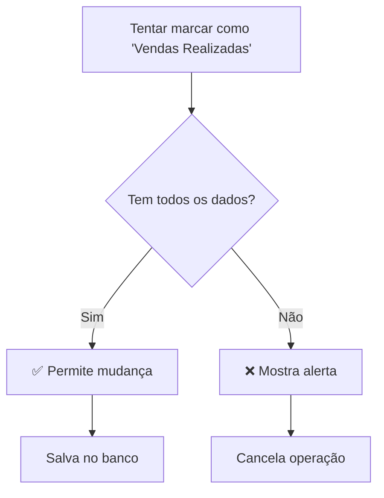

# 🛡️ Validações para "Vendas Realizadas"

## Funcionalidade Implementada

O sistema agora **impede** que um cliente seja marcado como "Vendas Realizadas" **sem** os dados obrigatórios preenchidos.

## 📋 Dados Obrigatórios

Para marcar como "Vendas Realizadas", é **obrigatório** preencher:

- ✅ **Valor da Venda** (> 0)
- ✅ **Tipo do Plano** (mensal/trimestral/semestral/anual)  
- ✅ **Valor Base do Plano** (> 0)

## 🔒 Onde as Validações Funcionam

### 1. **🎯 Kanban Board (CRM)**
- **Local**: `crm-page.tsx → handleEtapaChange()`
- **Comportamento**: Mostra alerta e **cancela** a mudança de etapa
- **Validação**: Completa (todos os 3 campos)

### 2. **✏️ Modal de Edição (CRM)**
- **Local**: `cliente-details-card.tsx → handleSave()`
- **Comportamento**: Impede o **salvamento** do formulário
- **Validação**: Completa (todos os 3 campos)

### 3. **➕ Modal de Criação (CRM)**
- **Local**: `novo-cliente-card.tsx → handleSubmit()`
- **Comportamento**: Impede a **criação** do cliente
- **Validação**: Completa (todos os 3 campos)

### 4. **⚡ Popover de Criação (Dashboard)**
- **Local**: `novo-cliente-popover.tsx → handleSave()`
- **Comportamento**: Valida apenas **valor da venda** (campos limitados)
- **Validação**: Parcial (só valor da venda)

### 5. **🔐 Backend (API)**
- **Local**: `supabase.ts → updateClienteEtapa()`
- **Comportamento**: **Rejeita** mudança de etapa via API direta
- **Validação**: Completa (todos os 3 campos)

## 💬 Mensagens de Alerta

### **Validação Completa:**
```
Para marcar como "Vendas Realizadas", é obrigatório preencher:

• Valor da Venda
• Tipo do Plano  
• Valor Base do Plano

Por favor, preencha todos os campos antes de continuar.
```

### **Validação Parcial (Popover):**
```
Para marcar como "Vendas Realizadas", é obrigatório preencher o Valor da Venda.

Para definir também o Tipo do Plano e Valor Base, use o modal completo de criação.
```

## 🔄 Fluxo de Validação



## 🎯 Cenários Testados

### ✅ **Cenário 1: Kanban Drag & Drop**
```
1. Cliente sem valor preenchido
2. Arrastar para "Vendas Realizadas"
3. Sistema mostra alerta e cancela
4. Cliente permanece na etapa anterior
```

### ✅ **Cenário 2: Edição Completa**
```
1. Abrir modal de edição
2. Mudar etapa para "Vendas Realizadas"
3. Tentar salvar sem preencher dados
4. Sistema impede salvamento
```

### ✅ **Cenário 3: Criação Nova**
```
1. Criar novo cliente
2. Selecionar "Vendas Realizadas"
3. Deixar campos em branco
4. Sistema impede criação
```

## 🛡️ Segurança em Camadas

1. **Frontend**: Validação imediata na interface
2. **Componentes**: Validação em cada ponto de entrada
3. **Backend**: Validação final na API
4. **Consistência**: Mesma lógica em todos os lugares

## 🔍 Debug

Para verificar se está funcionando:
1. Tentar marcar cliente como "Vendas Realizadas" sem dados
2. Verificar se alerta aparece
3. Confirmar que operação foi cancelada
4. Ver logs no console (F12) para validações backend

## ⚡ Benefícios

✅ **Dados Consistentes**: Impossível ter venda sem dados  
✅ **UX Clara**: Usuário sabe exatamente o que preencher  
✅ **Prova de Erros**: Funciona mesmo com tentativas diretas via API  
✅ **Flexível**: Diferente validação para diferentes contextos 